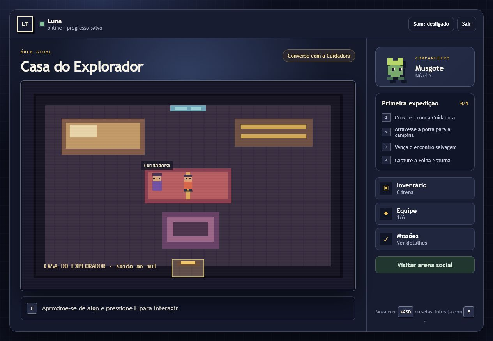

# Projeto LT

RPG 2D online original para navegador, com exploração, criaturas, batalhas por turno
e arena social. A Fase 18 transforma a fundação técnica existente em uma vertical
slice visual e jogável de aproximadamente 10–20 minutos.



## Requisitos

- Node.js 24.14.0;
- pnpm 11.9.0;
- Docker Desktop com Docker Compose.

## Início local no Windows PowerShell

```powershell
git clone https://github.com/lujhe4ever/jogopokemoncnx.git
Set-Location jogopokemoncnx
git switch feat/fase-18-vertical-slice-jogavel
corepack enable
pnpm install --frozen-lockfile
Copy-Item .env.example .env
docker compose up -d postgres
pnpm setup:local
pnpm dev
```

Abra `http://localhost:5173`. O servidor usa `http://localhost:3000`; o Vite encaminha
as chamadas `/api` e os WebSockets automaticamente.

## Como jogar

1. Crie uma conta descartável ou entre em uma conta existente.
2. Escolha um dos três companheiros originais. A escolha é permanente para a conta.
3. Na casa, use `WASD` ou setas para se mover e `E` para falar com a Cuidadora.
4. Saia pela porta ao sul e explore a Campina do Luar.
5. Colete o Orbe de captura e aproxime-se da Folha Noturna.
6. Use golpe ou defesa até vencer e então tente a captura.
7. Abra Inventário, Equipe ou Missões pelos botões da lateral.
8. Atualize a página para confirmar a retomada da sessão e do progresso.

No mobile, os controles direcionais e o botão `E` aparecem abaixo do mundo. O botão
`Som` habilita ou silencia os efeitos procedurais; o jogo funciona com áudio
desabilitado. `Sair` revoga a sessão atual.

## Verificação

```powershell
pnpm check
pnpm audit --prod --audit-level high
pnpm e2e:install
pnpm test:e2e
```

O E2E exige PostgreSQL ativo e migrations aplicadas. Ele cria uma conta descartável,
percorre casa e campina, batalha, captura, confere a equipe e valida persistência após
recarregar.

## Evidências visuais

- [escolha do companheiro](docs/screenshots/fase-18-onboarding.png);
- [Casa do Explorador](docs/screenshots/fase-18-casa.png);
- [batalha](docs/screenshots/fase-18-batalha.png);
- [layout mobile](docs/screenshots/fase-18-mobile.png).

## Documentação

- [estado atual](docs/current-state.md);
- [arquitetura](docs/architecture.md);
- [roadmap](docs/roadmap.md);
- [decisões](docs/decisions.md);
- [inventário de conteúdo](docs/content-inventory.md);
- [plano do alpha](docs/alpha-test-plan.md);
- [runbook operacional](docs/runbooks/operations.md).

Todo conteúdo ativado no runtime é original ou possui procedência verificável. As
branches de pesquisa com sprites de franquias externas permanecem fora desta entrega.
Nenhum deploy é realizado automaticamente.
