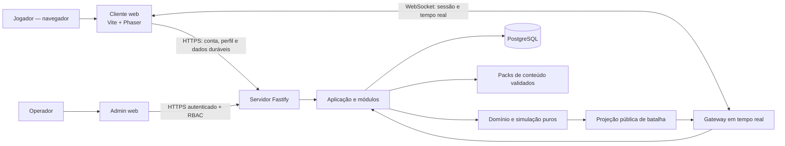
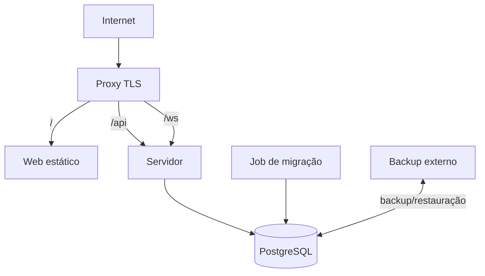

# Projeto LT — Arquitetura de Software

> Documento vivo e normativo da arquitetura do projeto.

| Campo | Valor |
| --- | --- |
| Status | **Proposta v0.1 para revisão** |
| Última atualização | 2026-07-23 |
| Escopo desta versão | Baseline arquitetural; nenhum código funcional |
| Repositório | `lujhe4ever/jogopokemoncnx` |
| Responsáveis | Proprietário do projeto e arquitetura técnica |

## 1. Como usar este documento

Este arquivo é a fonte principal para limites, princípios e decisões estruturais do
projeto. Ele deve permanecer curto o bastante para ser consultado e completo o
bastante para impedir que o sistema evolua por decisões locais contraditórias.

As marcações usadas são:

- **Confirmado**: requisito explicitamente definido pelo proprietário do projeto.
- **Proposta**: recomendação arquitetural aguardando aprovação.
- **Aceita**: decisão aprovada e vigente.
- **Substituída**: decisão mantida apenas para histórico e apontando para sua sucessora.

Depois que esta baseline for aprovada, decisões caras ou difíceis de reverter serão
registradas em `docs/adr/` por meio de Architecture Decision Records (ADRs). Alterações
arquiteturais exigem atualização deste documento ou um ADR relacionado no mesmo
conjunto de mudanças.

O fluxo de trabalho do projeto é obrigatório:

1. explicar a proposta, o escopo, os riscos e os critérios de aceite;
2. aguardar autorização explícita;
3. implementar somente o escopo autorizado;
4. verificar e apresentar evidências;
5. parar para revisão antes da próxima etapa.

## 2. Contexto

O Projeto LT é um RPG 2D online para navegador, inspirado em jogos clássicos de
exploração e captura de criaturas. O projeto é destinado exclusivamente a estudo e
uso privado, sem monetização ou comercialização.

O jogador inicia na própria casa, explora o mundo, interage com NPCs, encontra
criaturas, itens e baús, progride em missões e participa de batalhas. Um modo arena
separado reúne até 20 jogadores por instância e oferece chat, emotes, convites e
telões que exibem batalhas ao vivo por meio de eventos.

Contas usam e-mail e senha. Perfil, inventário e progresso são persistidos. O cliente
deve funcionar em desktop e mobile, carregar conteúdo sob demanda e poder ser
implantado em uma VPS com contêineres.

### 2.1 Restrições confirmadas

- A engine deve ser própria, modular e independente de personagens ou conteúdo
  específico.
- Conteúdo e assets devem ser substituíveis sem alterar a engine ou regras centrais.
- Core, gameplay, mundo, batalha, rede, persistência e administração precisam ter
  responsabilidades separadas.
- A arquitetura precede o primeiro código funcional.
- Cada etapa depende de explicação, autorização, implementação, verificação e pausa.

### 2.2 Objetivos

- Construir uma base sustentável por vários meses, com dependências explícitas.
- Manter regras testáveis sem navegador, renderer, rede ou banco de dados.
- Tratar o servidor como autoridade sobre progresso e ações relevantes.
- Permitir evolução do modo solo/instanciado para experiências online sem reescrever
  o domínio.
- Entregar fatias verticais pequenas e jogáveis, começando pela casa do jogador.
- Operar inicialmente com simplicidade em uma única VPS e crescer somente com
  evidências de necessidade.
- Tornar conteúdo, arte, áudio, mapas e textos integralmente substituíveis.

### 2.3 Não objetivos iniciais

- Microserviços, Kubernetes ou escala horizontal antes de medições reais.
- MMORPG de mundo único e ilimitado.
- Aplicativos nativos.
- Marketplace, monetização ou economia com valor real.
- Editor de conteúdo completo na primeira entrega.
- Event sourcing global.
- Motor de física genérico ou ECS criado de forma preventiva.
- Compatibilidade automática com assets, ROMs ou dados extraídos de franquias.

## 3. Direcionadores de qualidade

A ordem inicial de prioridade é:

1. correção, segurança e integridade do progresso;
2. manutenibilidade e clareza de limites;
3. jogabilidade responsiva;
4. observabilidade e capacidade de recuperação;
5. desempenho e custo operacional;
6. escalabilidade horizontal futura.

As metas abaixo são hipóteses iniciais e devem ser confirmadas por benchmark em
hardware de referência:

| Indicador | Meta inicial proposta |
| --- | --- |
| Arena | 20 avatares controláveis por instância |
| Simulação de mundo/arena | 20 Hz configuráveis |
| Envio de deltas | Aproximadamente 10 Hz, ajustável |
| Tick do servidor | Janela de 50 ms; duração p95 menor que 25 ms |
| Renderização desktop | 60 fps em cena de referência |
| Renderização mobile | 30 fps em dispositivo de referência |
| Carregamento | Login, mundo, batalha, arena e packs em chunks separados |
| Banco no tick | Zero consultas ou esperas de I/O dentro do loop |

Dispositivos, rede, mapa, quantidade de espectadores e massa de conteúdo usados nos
benchmarks deverão ser registrados antes de transformar essas metas em SLOs.

## 4. Princípios arquiteturais

### 4.1 Domínio puro

Regras de jogo e simulação são TypeScript puro. Elas não importam Phaser, DOM,
Fastify, WebSocket, Prisma ou APIs específicas de Node. Relógio, RNG e I/O entram por
interfaces explícitas.

### 4.2 Dependências apontam para dentro

Domínio e casos de uso não conhecem infraestrutura. Adaptadores de navegador, rede e
banco implementam portas definidas nas camadas internas. Modelos de banco, domínio e
protocolo são diferentes e mapeados nas bordas.

### 4.3 Servidor autoritativo

O cliente envia intenções, nunca resultados finais. Movimento, colisão, distância,
cooldowns, inventário, captura, recompensas, missões e batalha são validados pelo
servidor.

### 4.4 Conteúdo orientado a dados

Criaturas, itens, habilidades, NPCs, diálogos, missões, mapas, emotes e assets são
referenciados por IDs estáveis e definidos em packs validados. Regras não contêm
nomes, caminhos ou propriedades de uma franquia.

### 4.5 Monólito modular antes de distribuição

Um deploy de servidor e um PostgreSQL são suficientes para a primeira etapa. Os
limites internos serão preservados para permitir extração futura, mas Redis, filas e
serviços adicionais só entram mediante métricas, necessidade operacional e ADR.

### 4.6 Contratos explícitos e versionados

Tipos TypeScript sozinhos não são contratos de rede. HTTP, WebSocket, conteúdo e
savegames possuem schemas validados em runtime e versões independentes.

### 4.7 Determinismo onde produz valor

Movimento, colisão e batalha usam passo fixo, relógio injetável e RNG com seed quando
necessário. O objetivo é permitir replay, teste e reconciliação, não prometer
determinismo idêntico entre qualquer plataforma sem validação.

### 4.8 Abstração conquistada por uso

Uma API genérica só entra na engine quando existir um consumidor real. Otimizações
dependem de profiling. Nenhum “módulo compartilhado” pode virar depósito de código sem
owner.

## 5. Visão do sistema



HTTP é usado para autenticação, perfil, administração e operações duráveis que não
dependem do tick. WebSocket é usado para presença, intenções de movimento, mundo,
arena, batalha e recursos sociais.

## 6. Baseline tecnológica proposta

| Área | Proposta | Motivo |
| --- | --- | --- |
| Linguagem | TypeScript estrito | Contratos claros e compartilhamento seguro de código puro |
| Monorepo | `pnpm` workspaces | Instalação determinística e pacotes com limites explícitos |
| Orquestração de tarefas | Turborepo, após scaffold mínimo | Cache e pipeline sem impor framework de aplicação |
| Cliente | Vite + Phaser 3 | Build rápido e runtime 2D maduro |
| Servidor | Node em versão LTS fixada + Fastify | Baixa sobrecarga, schemas e composição por plugins |
| Tempo real | WebSocket atrás de uma porta de transporte | Protocolo próprio e substituição da biblioteca |
| Banco | PostgreSQL | Transações, restrições e operação conhecida em VPS |
| ORM | Prisma somente na infraestrutura | Migrações e acesso tipado sem vazar modelos |
| Validação | Schemas runtime compartilhados | Rejeição segura de payloads e geração de contratos |
| Logs | Pino/JSON estruturado | Integração natural com Fastify e ingestão simples |
| Infraestrutura | Docker Compose inicialmente | Paridade local/VPS com baixa complexidade |
| Automação | GitHub Actions | Qualidade e imagens reproduzíveis |

### 6.1 Fastify em vez de Nest

**Status: Proposta.**

Fastify mantém a camada de transporte pequena, tem boa integração com schema,
WebSocket e logs, e evita que decorators ou container de framework entrem no domínio.
A organização será garantida por módulos, portas, composition roots e testes de
dependência.

Nest poderá ser reavaliado somente se a complexidade de composição demonstrar custo
real. Uma troca de framework não deve exigir mudanças nas regras centrais.

### 6.2 Componentes adiados conscientemente

- Redis ou NATS: somente quando houver mais de um processo, presença distribuída ou
  fan-out que não caiba em uma instância.
- Fila durável/outbox: quando um evento precisar sobreviver a falha e alcançar um
  consumidor assíncrono.
- Object storage/CDN: quando volume, atualização ou distribuição de assets justificar.
- Serviços separados: quando isolamento de escala, falha ou ownership superar o custo
  operacional.

## 7. Organização proposta do repositório

```text
/
├─ apps/
│  ├─ web/                    # Cliente e composition root do navegador
│  ├─ server/                 # HTTP, WebSocket, aplicação e adaptadores
│  └─ admin/                  # Criado somente quando houver caso de uso aprovado
├─ packages/
│  ├─ engine-core/            # Loop, relógio, eventos, geometria e portas
│  ├─ engine-phaser/          # Render, input, áudio e lifecycle do Phaser
│  ├─ game-simulation/        # Movimento e colisão compartilháveis
│  ├─ battle-domain/          # Máquina de estados de batalha
│  ├─ protocol/               # Schemas HTTP/WS públicos e versionados
│  ├─ content-contracts/      # Schemas de packs e catálogo de assets
│  ├─ config/                 # Validação de configuração por ambiente
│  └─ testing/                # Builders e harnesses realmente reutilizados
├─ content/
│  └─ packs/                  # Conteúdo original/licenciado, sem código arbitrário
├─ infra/                     # Docker, proxy, deploy e operação
├─ docs/
│  └─ adr/                    # Decisões difíceis de reverter
└─ architecture.md
```

A árvore é um destino, não uma ordem para criar pastas vazias. Cada pacote nasce com
um consumidor concreto. Dentro de `apps/server`, os módulos iniciais previstos são:

- `identity-profile`;
- `player-progress`;
- `world`;
- `creatures`;
- `inventory`;
- `quests`;
- `battle`;
- `arena-social`;
- `content`;
- `persistence`;
- `admin`.

Nenhum módulo acessa tabelas ou internals de outro diretamente. Coordenação ocorre por
casos de uso, comandos e eventos de aplicação tipados. O módulo de jogador não pode
se tornar um “módulo deus”.

### 7.1 Regra de dependência

```text
apps/composition roots
        ↓
adapters de entrada e infraestrutura
        ↓
casos de uso / aplicação
        ↓
domínio, engine-core e contratos internos
```

Importações no sentido inverso são proibidas e deverão ser verificadas no CI.
`engine-phaser` depende de `engine-core`; `engine-core` nunca depende de
`engine-phaser`.

## 8. Engine e simulação

### 8.1 Responsabilidades do `engine-core`

- relógio e loop de passo fixo;
- ciclo de vida de cenas/instâncias sem dependência do Phaser;
- eventos tipados e escopados;
- vetores, unidades, geometria e colisão simples;
- interfaces `InputPort`, `RenderPort`, `AudioPort` e `AssetPort`;
- scheduler determinístico quando necessário;
- IDs e utilitários mínimos, com ownership explícito.

Phaser executa renderização, coleta de input, áudio e carregamento no cliente. Phaser
Arcade/Matter pode auxiliar efeitos visuais, mas não decide uma posição válida no
servidor.

### 8.2 Física e movimento

Movimento e colisão usam passo fixo e representação numérica definida pelo domínio.
O mesmo kernel puro pode ser executado pelo servidor e pela previsão do cliente.

O cliente:

- captura intenção;
- aplica previsão apenas ao avatar local;
- guarda comandos ainda não confirmados;
- interpola avatares remotos;
- reconcilia a partir do último comando processado pelo servidor.

O servidor:

- valida sequência, velocidade, colisão e estado do jogador;
- processa comandos no tick da instância;
- publica snapshots/deltas;
- nunca espera banco, chat ou API externa dentro do tick.

### 8.3 Eventos

Barramentos são escopados por módulo, sala ou agregado. Não haverá um barramento global
sem ownership. Eventos de domínio não são enviados diretamente ao cliente; uma
projeção explícita seleciona e transforma os campos públicos.

## 9. Modelo de execução do servidor

O primeiro servidor é um monólito modular em um único processo:

- Fastify recebe HTTP e upgrade WebSocket;
- gateways validam e convertem mensagens em comandos;
- casos de uso coordenam domínio, repositórios e salas;
- `RoomRegistry` mantém instâncias transitórias em memória;
- PostgreSQL guarda somente estado durável;
- composition root cria dependências e controla lifecycle.

Cada sala tem ID, tipo, capacidade, owner de processo e ciclo de vida explícito desde
o início. Os tipos iniciais são:

- `private-home`: casa privada do jogador;
- `world-zone`: zona de exploração compartilhada ou instanciada;
- `battle-room`: execução isolada de batalha;
- `arena-room`: espaço social com limite inicial de 20 jogadores.

Estado transitório pode ser perdido com uma queda do processo na primeira topologia.
Progresso crítico deve estar confirmado por transação ou checkpoint. Reconexão deve
retomar o que ainda existe ou devolver o jogador a um ponto seguro.

## 10. Protocolo e tempo real

### 10.1 Envelope WebSocket

O protocolo terá schema runtime e envelope equivalente a:

```text
protocolVersion
type
messageId
correlationId
sequence
serverTime
payload
```

Campos exatos serão definidos em ADR e contrato. As regras são:

- handshake negocia versão e recursos;
- cliente usa uma conexão por sessão;
- canais lógicos separam sessão, mundo, arena, batalha e social;
- comandos possuem ID e sequência para deduplicação;
- servidor confirma o último input processado;
- reconexão recebe snapshot e depois deltas ordenados;
- heartbeat detecta conexões mortas;
- tamanho, frequência e fila de mensagens têm limites;
- incompatibilidade gera erro e código de encerramento estruturados;
- backpressure pode descartar deltas substituíveis, nunca confirmações críticas.

Mudanças incompatíveis incrementam a versão principal. Durante deploys que exigirem
compatibilidade, o servidor deverá suportar a versão corrente e a anterior por janela
definida.

### 10.2 Interesse espacial

O servidor envia somente entidades e eventos relevantes à área de interesse do
jogador. Deltas substituem snapshots completos durante operação normal. A frequência
é configurável por tipo de sala e será ajustada por benchmark.

### 10.3 Recursos sociais

- Chat: tamanho, frequência e conteúdo validados; IDs e timestamps são do servidor;
  haverá gancho de moderação e mute.
- Emotes: somente IDs presentes no catálogo autorizado.
- Convites: tokens opacos, expiráveis e de uso único; permissão e lotação são
  revalidadas no aceite.
- Presença: estado efêmero da sala, não registro durável a cada mudança.

## 11. Separação entre mundo, batalha e arena

### 11.1 Mundo

O módulo de mundo possui zonas, movimento, colisão, spawns, interação e transições.
Ele coordena encontros, mas não executa regras internas de batalha, inventário ou
missão.

### 11.2 Batalha

Batalha é uma máquina de estados independente, orientada a comandos e eventos. Ela
recebe participantes e regras, usa RNG injetável/seed do servidor e produz resultado
validável. Não conhece WebSocket, Phaser, Prisma ou arena.

Comandos são idempotentes e sequenciados. Resultados e checkpoints necessários são
persistidos, sem transformar o jogo inteiro em event sourcing.

### 11.3 Arena

Arena possui presença, lotação, chat, emotes, convites e assinaturas de telões. Ela
não executa batalhas: assina projeções públicas produzidas pelo módulo de batalha.

`BattleProjection` mantém uma allowlist de campos e remove escolhas secretas, dados
privados e comandos. Telões e espectadores são somente leitura. Um atraso configurável
pode ser introduzido se houver risco de espionagem durante PvP.

## 12. Dados e persistência

### 12.1 Ownership

Modelos previstos incluem conta, sessão, perfil, progresso, instância de criatura,
inventário, progresso de missão, checkpoint de mundo e registro de batalha. O schema
físico pode ser único, mas cada conjunto tem owner lógico.

Definições de espécies, itens, habilidades, mapas e missões pertencem a packs de
conteúdo versionados; dados de jogador referenciam IDs estáveis desses packs.

### 12.2 Prisma isolado

Prisma existe apenas em adaptadores de persistência do servidor. Tipos Prisma não
podem aparecer no domínio, protocolo ou cliente. Interfaces de repositório pertencem
à camada interna; implementações Prisma fazem o mapeamento.

JSONB é reservado a estruturas evolutivas com schema e versão explícitos. Dados que
precisam de integridade relacional, busca ou transação permanecem normalizados.

### 12.3 Estratégia de gravação

Não se persiste cada frame ou movimento. O sistema grava:

- transições e recompensas críticas;
- mudanças de inventário, captura e progresso em transações;
- checkpoints periódicos e em desconexão controlada;
- resultado de batalha e informações necessárias a auditoria/replay;
- versão do agregado para concorrência otimista.

Operações repetíveis usam chaves de idempotência e restrições únicas. Migrações são
imutáveis, versionadas e testadas desde um banco vazio. Produção usa estratégia
expand/contract quando uma mudança não puder ser aplicada de uma vez.

### 12.4 Recuperação

Backups devem ficar fora do volume e da VPS de produção, ser criptografados e ter
restauração testada. RPO, RTO e retenção serão aprovados antes de qualquer ambiente
externamente acessível.

## 13. Autenticação e segurança

- Senhas serão derivadas com Argon2id; parâmetros serão definidos por benchmark e
  poderão ser elevados no futuro.
- Sessões serão opacas, revogáveis e armazenadas no servidor.
- Cookies serão `Secure`, `HttpOnly` e `SameSite`, com rotação após autenticação.
- O WebSocket usará ticket efêmero e de uso único obtido por HTTPS autenticado.
- Tokens duradouros não irão para URL nem `localStorage`.
- Origem, CORS e CSP terão allowlists explícitas.
- Todo payload terá schema, tamanho máximo e limite de frequência.
- Login, chat, convites, emotes e comandos de jogo terão rate limiting separado.
- E-mail, senha, token, segredo e payload sensível não serão registrados em logs.
- Verificação de e-mail e recuperação de senha usarão tokens aleatórios, com hash no
  banco, expiração e uso único quando esses fluxos forem implementados.
- Admin terá RBAC, auditoria e MFA antes de exposição fora de rede privada.
- Segredos nunca serão incluídos em imagem, Compose, frontend ou repositório.

Segurança não depende da honestidade do cliente. Um cliente modificado não pode
conceder item, captura, missão, posição final ou resultado de batalha.

## 14. Conteúdo, assets e propriedade intelectual

### 14.1 Contrato de conteúdo

`ContentPack` e `AssetCatalog` terão:

- IDs estáveis e namespaced, por exemplo `original:item:healing-herb`;
- versão, checksum e dependências;
- schemas para mapas, criaturas, itens, habilidades, NPCs, diálogos e missões;
- catálogo que resolve IDs semânticos em arquivos de cliente;
- localização separada do domínio;
- origem, autor e licença por asset;
- hash negociado entre cliente e servidor.

O catálogo unificado implementado em `@lt/content-contracts` separa identidade lógica,
origem, revisão, hash, licença, aprovação e estado de runtime. Um asset só pode ser
resolvido pelo runtime quando o arquivo e a fonte estão aprovados, a redistribuição
está explicitamente permitida, há revisão/hash/decisão rastreáveis e a feature flag
específica está ativa. Flags gerais não liberam quarentena.

Animações de apresentação são metadados determinísticos e não alteram a simulação
autoritativa. Áudio é acessado pela porta central de `@lt/audio-domain`; cenas não
carregam sons diretamente. Catálogos de pesquisa e mídia bloqueada não são incluídos
no bundle nem pré-carregados no início.

Packs são declarativos e validados no build. Não podem executar JavaScript arbitrário.
O servidor carrega somente dados necessários às regras; o cliente carrega arte, áudio
e mapas sob demanda por zona.

Savegames armazenam IDs e versões, nunca caminhos de arquivos. Renomear ou remover um
ID persistido exige migração de conteúdo/save.

### 14.2 Política de propriedade intelectual

**Confirmado:** o projeto é privado, educacional e não comercial.

Essa finalidade não elimina automaticamente riscos de copyright, marca ou identidade
visual, e um repositório público pode caracterizar distribuição. Portanto:

- não serão adicionados nomes, logotipos, sprites, músicas, mapas, textos, dados
  extraídos ou outros assets de franquias sem autorização verificável;
- conteúdo de desenvolvimento será original, CC0 ou licenciado de forma compatível;
- a procedência e a licença serão registradas;
- aprovação de uma fonte não aprova automaticamente cada arquivo;
- conversão, recorte ou animação não altera titularidade e exige permissão de
  modificação quando produzir derivado;
- material sem origem comprovada ficará em quarentena e fora do repositório;
- `THIRD_PARTY_NOTICES.md` e o inventário de licenças registram cada lote de
  terceiros publicado;
- branding, nomes de domínio e identidade visual deverão ser originais.

Desacoplamento técnico facilita substituição, mas não corrige uso indevido.

O primeiro lote de mídia aprovado, D-025, fixa oito arquivos-fonte Kenney CC0 por
versão, URL, tamanho e SHA-256. Somente 54 arquivos selecionados são publicados, sem
transformação dos bytes. A licença permite redistribuição, mas a ativação no runtime
continua separada e exige revisão visual, mapeamento semântico, orçamento e feature
flag. Essa aprovação não alcança a mídia Pokémon temporária da D-023.

## 15. Performance e experiência mobile

### 15.1 Cliente

- divisão de código por boot/login, mundo, batalha, arena e administração;
- packs por zona, carregados sob demanda e versionados;
- atlases, formatos comprimidos e prefetch controlado da próxima zona;
- culling de entidades e tiles fora da câmera;
- pooling somente após profiling;
- teto de device pixel ratio em dispositivos limitados;
- descarte seguro de packs e limite de cache;
- input abstrato para teclado, gamepad e toque;
- tratamento de resize, suspensão, retorno ao foreground e perda de contexto WebGL;
- tarefas pesadas em worker somente quando medições justificarem.

### 15.2 Servidor

- um scheduler por conjunto de salas, não um timer por entidade;
- área de interesse e deltas compactos;
- limite por sala, mensagem e conexão;
- nenhuma espera externa no tick;
- instrumentação de duração, fila e atraso do event loop;
- degradação controlada antes de queda, reduzindo frequência de deltas substituíveis.

O bundle inicial da tela de login não deve incorporar mapas, batalhas ou packs ainda
desnecessários. Orçamentos de bytes e memória serão definidos com o primeiro protótipo
medido.

## 16. Observabilidade

Logs JSON conterão IDs de requisição, conexão, sala e batalha, mas não PII ou segredos.
Métricas mínimas:

- disponibilidade e prontidão;
- conexões WebSocket e reconexões;
- salas e jogadores por tipo;
- duração do tick e atraso do event loop;
- fila, bytes e mensagens descartadas;
- latência e erros por comando;
- pool e latência do PostgreSQL;
- falhas de autenticação e rate limiting;
- operações econômicas e administrativas auditáveis;
- idade e resultado do último backup/restauração testada.

OpenTelemetry será adotado nos limites HTTP, WebSocket e banco quando existir ambiente
integrado. Auditoria de segurança/economia terá retenção e acesso separados dos logs
operacionais.

## 17. Estratégia de testes

| Nível | Foco |
| --- | --- |
| Unitário | Domínio, casos de uso, máquina de batalha e regras de conteúdo |
| Determinístico | Simulação com relógio, RNG e replay controlados |
| Propriedades | Inventário, economia, captura e invariantes de batalha |
| Contrato | Cada mensagem HTTP/WS e compatibilidade entre versões |
| Integração | PostgreSQL real efêmero e migrações desde banco vazio |
| E2E | Login, casa, movimento, reconexão e jornadas críticas |
| Carga/soak | 20 jogadores por arena, espectadores e estabilidade prolongada |
| Arquitetural | Imports proibidos, ciclos e vazamento de tipos de infraestrutura |

Testes do domínio e da simulação devem executar em Node sem DOM, Phaser, Fastify,
Prisma ou assets. Um pack original de exemplo deverá poder ser substituído sem alterar
engine ou regras.

## 18. Infraestrutura e entrega

### 18.1 Topologia inicial de VPS



Usar a mesma origem para web, `/api` e `/ws` reduz complexidade de cookies e CORS.
Imagens serão multi-stage, reproduzíveis, executadas como usuário não-root e conterão
somente artefatos de runtime.

Health checks de disponibilidade e prontidão serão distintos. Encerramento gracioso
para novas salas, dreno de conexões e checkpoint ocorrerá dentro de um prazo limitado.
A VPS única é um ponto único de falha aceito conscientemente na etapa inicial.

### 18.2 CI

Pull requests executarão progressivamente:

- instalação pelo lockfile;
- formatação, ESLint e TypeScript estrito;
- regras de dependência entre módulos;
- testes unitários, determinísticos e de contrato;
- build do cliente e servidor;
- validação de Prisma e migrações;
- validação de packs, hashes e licenças;
- build e scan da imagem Docker;
- detecção de segredos e dependências vulneráveis.

Husky e lint-staged oferecem feedback local, mas o CI é a autoridade.

### 18.3 CD

Imagens imutáveis serão identificadas pelo commit. O deploy promove por digest,
executa migrações em etapa separada, verifica saúde e conserva uma versão anterior
para rollback. Produção terá aprovação manual inicialmente. Estratégia detalhada de
backup, migração e rollback precede o primeiro deploy externo.

## 19. Roadmap por fatias autorizáveis

Cada fase termina com demonstração, evidências e pausa. Esta seção preserva o
roadmap macro da baseline. O detalhamento executável, a numeração operacional e o
status corrente pertencem a `docs/roadmap.md`; esse detalhamento pode dividir uma
macrofase em fatias menores, mas não pode alterar os limites arquiteturais daqui sem
registrar a decisão correspondente.

### Fase 0A — Baseline arquitetural

- conectar o repositório;
- confirmar o estado existente;
- criar somente `architecture.md`;
- registrar D-001 a D-010 como propostas antes de qualquer scaffold.

Essa entrega foi concluída isoladamente no primeiro commit do repositório.

### Fase 0B — Governança e continuidade colaborativa

- criar `AGENTS.md` e a documentação operacional em `docs/`;
- separar baseline normativa, roadmap detalhado, design, decisões, estado e histórico;
- definir o handoff entre duas pessoas e duas IAs;
- revisar as propostas técnicas exigidas pela Fase 1 antes de qualquer scaffold.

Fase 0B amplia a governança documental; não reabre nem invalida o critério histórico
de que a Fase 0A continha somente `architecture.md`.

### Fase 1 — Fundação do monorepo

- workspace, versões fixadas e regras de dependência;
- Vite/Phaser, Fastify e TypeScript mínimos;
- ESLint, Prettier, testes, Husky e CI;
- Docker local com PostgreSQL;
- ADRs iniciais;
- nenhuma mecânica ampla de jogo.

### Fase 2 — Identidade e perfil

- cadastro/login por e-mail e senha;
- sessão segura e perfil mínimo;
- migrações, testes e telemetria;
- fluxo WebSocket com ticket efêmero.

### Fase 3 — Primeira fatia jogável: casa

- boot e carregamento lazy da casa;
- engine-core e adaptador Phaser mínimos;
- input de teclado/toque, movimento e colisão;
- servidor autoritativo, previsão e reconciliação;
- checkpoint de posição e reconexão.

### Fase 4 — Exploração e interação

- zonas, transições e carregamento de mapas;
- NPCs, itens, baús, inventário e missões em fatias pequenas;
- packs de conteúdo originais validados.

### Fase 5 — Criaturas e batalha

- instâncias de criatura e progressão;
- batalha separada, determinística e reproduzível;
- persistência transacional e projeções públicas.

### Fase 6 — Encontros e captura

- encontro no mundo;
- tentativa de captura validada no servidor;
- atualização idempotente de inventário/progresso.

### Fase 7 — Arena e recursos sociais

- sala com capacidade de 20 jogadores;
- chat, emotes e convites;
- telões/espectadores por eventos sanitizados;
- testes de carga, backpressure e privacidade.

### Fase 8 — Administração e operação

- admin com RBAC, auditoria e MFA quando aplicável;
- ferramentas de conteúdo estritamente necessárias;
- backup/restauração, alertas, hardening e deploy de VPS.

## 20. Riscos principais

| Risco | Nível | Mitigação inicial |
| --- | --- | --- |
| Conteúdo ou branding sem licença | Crítico | Conteúdo original/licenciado, inventário e quarentena |
| Escopo crescer antes de uma fatia jogável | Alto | Roadmap vertical, autorização por fase e não objetivos |
| Cliente/servidor divergirem | Alto | Autoridade no servidor, kernel puro e testes de replay |
| Duplicação/corrupção de inventário | Alto | Transações, idempotência, constraints e versão |
| Tick bloqueado por I/O | Alto | Persistência fora do loop e métricas de tick |
| Protocolo quebrar clientes | Alto | Schemas runtime, versões e janela de compatibilidade |
| Telão vazar informação privada | Alto | Projeção pública allowlist e testes de privacidade |
| Migração quebrar produção | Alto | Expand/contract, backup, teste e job separado |
| Queda da VPS interromper salas | Alto aceito inicialmente | Checkpoints, restauração e evolução orientada a métricas |
| Acoplamento ao Prisma/Phaser | Médio | Portas, adapters e testes de dependência |
| Abstração excessiva da engine | Médio | APIs criadas por fatias com consumidor real |
| Conteúdo novo invalidar saves | Médio | IDs estáveis, versões e migrações |
| Mobile exceder memória/download | Médio | Packs por zona, limites de cache e teste em dispositivo |
| Fan-out de espectadores | Médio | Projeções compactas, backpressure e benchmark separado |

## 21. Registro inicial de decisões

| ID | Decisão | Status |
| --- | --- | --- |
| D-001 | Monorepo TypeScript com `pnpm` workspaces | Proposta |
| D-002 | Monólito modular Fastify em uma VPS | Proposta |
| D-003 | Servidor autoritativo e simulação de passo fixo | Proposta |
| D-004 | Phaser restrito ao adaptador cliente | Proposta |
| D-005 | Prisma restrito à infraestrutura | Proposta |
| D-006 | Protocolo runtime validado e versionado | Proposta |
| D-007 | Packs de conteúdo e catálogo de assets substituíveis | Proposta |
| D-008 | Sessão opaca e ticket WebSocket efêmero | Proposta |
| D-009 | Redis, broker e microserviços adiados até haver gatilho | Proposta |
| D-010 | Conteúdo somente original ou comprovadamente licenciado | Proposta |

Após aprovação, decisões D-001 a D-010 serão marcadas como aceitas e as que exigirem
análise de alternativas ganharão ADRs em suas fases de implementação.

## 22. Questões a fechar antes da Fase 1

- Confirmar esta baseline e a escolha Fastify em vez de Nest.
- Confirmar `pnpm` e Turborepo.
- Definir visibilidade e política de colaboradores do repositório.
- Selecionar e fixar a versão LTS do Node disponível no ambiente.
- Definir navegadores e dispositivos mobile de referência.
- Definir o primeiro pack original de placeholder e sua licença.
- Definir meta inicial de espectadores simultâneos por arena.
- Definir RPO, RTO e retenção antes do primeiro deploy externo.

## 23. Critérios de aceite da Fase 0

### 23.1 Fase 0A — baseline arquitetural

- O primeiro commit contém somente `architecture.md`.
- Nenhum scaffold, dependência, asset ou código funcional foi criado.
- Objetivos, não objetivos, limites e dependências permitidas estão documentados.
- Estado transitório e durável estão separados.
- Engine e domínio não dependem de Phaser, Fastify, Prisma ou conteúdo de franquia.
- Mundo, batalha e arena têm ownership separado.
- Segurança, dados, protocolo, performance, testes e operação têm baseline explícita.
- Decisões não aprovadas estão marcadas como propostas.
- Riscos de propriedade intelectual estão registrados sem presumir proteção pelo uso
  privado.
- A próxima fase permanece bloqueada até revisão e autorização explícita.

### 23.2 Fase 0B — governança colaborativa

- `AGENTS.md` e os documentos obrigatórios em `docs/` existem e têm responsabilidades
  não conflitantes.
- O roadmap detalhado distingue requisito, proposta, status e critério de aceite.
- `docs/current-state.md` e `docs/work-log.md` permitem retomar o projeto apenas pelo
  estado publicado no GitHub.
- D-001 a D-010 permanecem propostas até aprovação explícita do proprietário.
- Nenhum scaffold, dependência, asset ou código funcional é criado.
- Merge da documentação e início da Fase 1 continuam bloqueados até revisão e
  autorização explícita.
