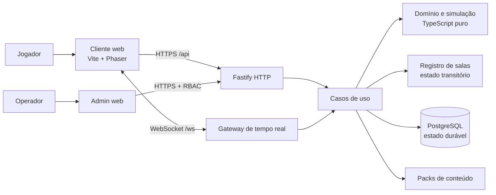
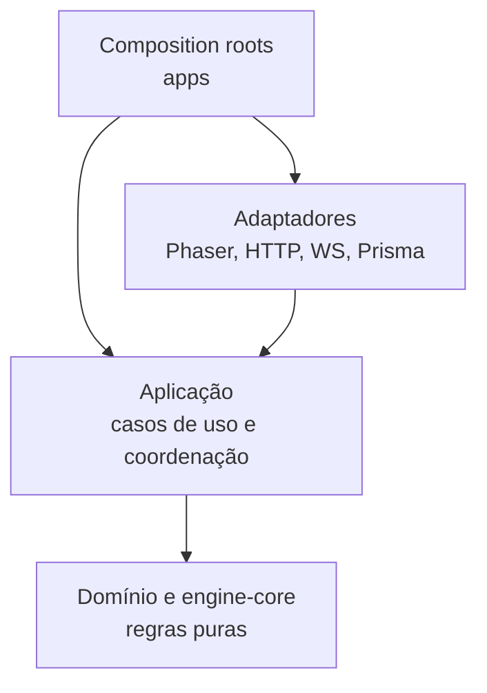
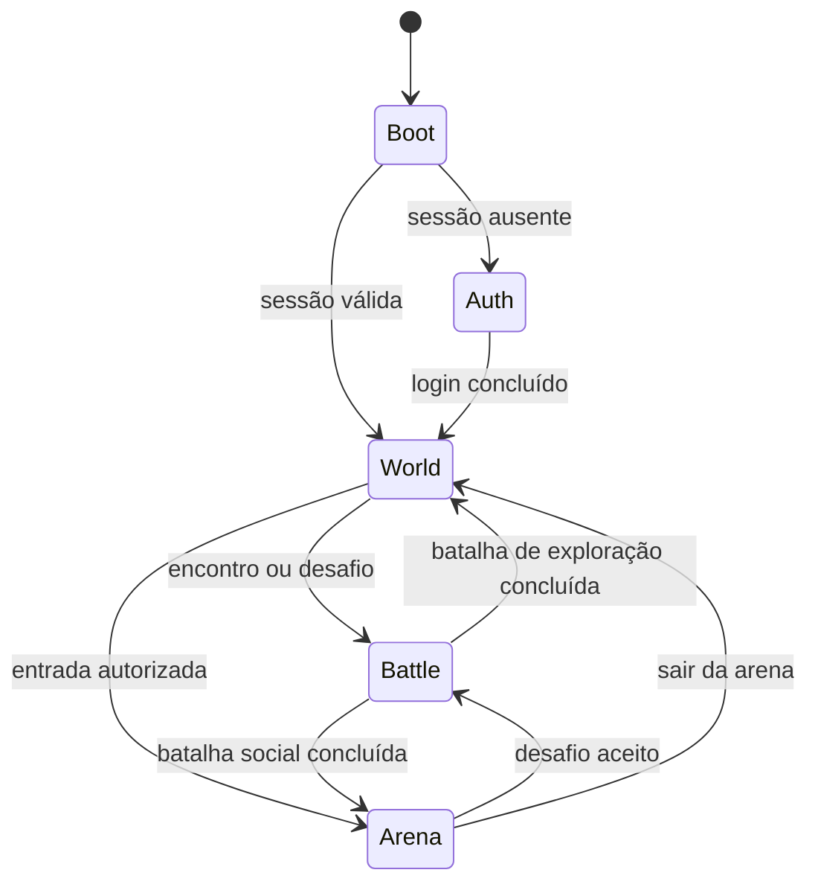
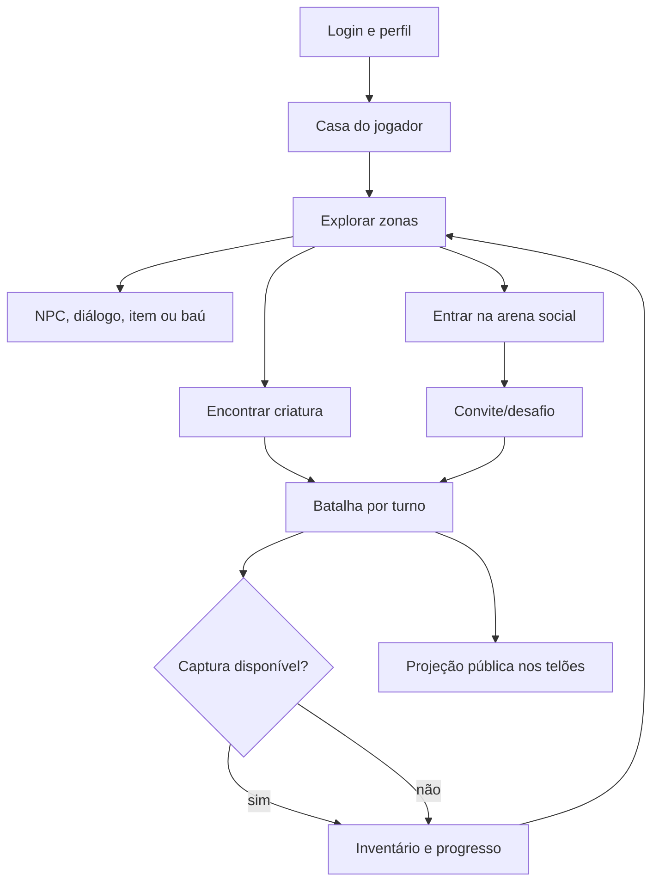
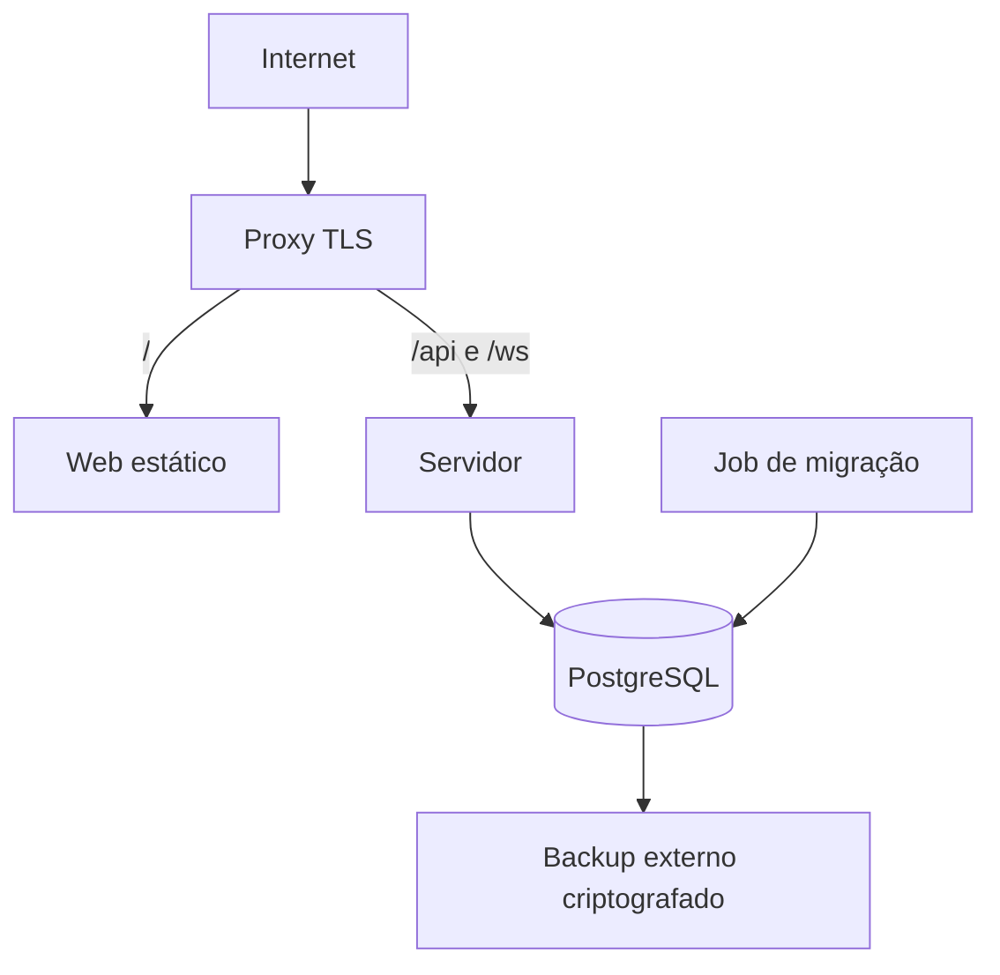

# Arquitetura operacional

| Campo | Valor |
| --- | --- |
| Status | **Proposta para revisão** |
| Atualizado em | 2026-07-23 |
| Implementação existente | Nenhuma |
| Baseline normativa | [`../architecture.md`](../architecture.md) |
| Decisões D-001 a D-010 | **Proposta** |

## 1. Propósito e relação com a baseline

O arquivo raiz `architecture.md` é a referência normativa para princípios, limites,
qualidades e decisões sistêmicas. Este documento descreve como esses limites deverão
aparecer na organização e nos fluxos do sistema à medida que forem implementados.

Se houver divergência, a baseline raiz prevalece até que a divergência seja discutida
e ambos os arquivos sejam atualizados no mesmo conjunto de mudanças. Nenhuma seção
abaixo afirma que o componente já existe.

## 2. Visão geral

O sistema proposto possui três superfícies:

- cliente web para jogadores;
- servidor autoritativo para API e tempo real;
- cliente administrativo separado e protegido.

PostgreSQL armazena estado durável. Salas de mundo, batalha e arena mantêm estado
transitório em memória na topologia inicial. Packs de conteúdo versionados alimentam
regras e assets sem acoplar a engine a uma franquia.



## 3. Tecnologias propostas

| Camada | Tecnologia | Estado |
| --- | --- | --- |
| Linguagem | TypeScript estrito | Proposta |
| Workspace | `pnpm` workspaces | Proposta |
| Orquestração | Turborepo | Proposta, precisa de confirmação |
| Web | Vite + Phaser 3 | Proposta |
| UI fora do canvas | HTML/CSS | Proposta |
| Servidor | Node.js LTS + Fastify | Proposta |
| Tempo real | WebSocket atrás de uma porta | Proposta |
| Persistência | PostgreSQL + Prisma | Proposta |
| Validação | Schemas compartilhados em runtime | Proposta |
| Logs | Pino em JSON | Proposta |
| Infraestrutura | Docker Compose em VPS Linux | Proposta |

Versões, bibliotecas concretas de schema e implementação WebSocket serão escolhidas na
Fase 1 ou em spikes autorizados. A arquitetura não depende da biblioteca de
transporte.

## 4. Camadas e responsabilidades



### 4.1 Domínio e engine-core

Responsáveis por:

- relógio e loop de passo fixo;
- eventos tipados e escopados;
- geometria, movimento e colisão simples;
- regras de criatura, inventário, missão e batalha;
- máquinas de estado;
- portas para render, input, áudio, assets, relógio, RNG e persistência.

Não podem importar Phaser, DOM, Fastify, WebSocket, Prisma ou código de composição.

### 4.2 Aplicação

Responsável por:

- executar casos de uso;
- coordenar módulos sem expor internals;
- definir transações e idempotência;
- converter eventos internos em projeções públicas;
- acionar repositórios por interfaces;
- mover jogadores entre instâncias de mundo, batalha e arena.

### 4.3 Adaptadores

Responsáveis por:

- Phaser: render, input, áudio, câmera e carregamento;
- HTTP/WebSocket: autenticar, validar e mapear contratos;
- Prisma: mapear modelos de persistência;
- conteúdo: validar e resolver packs;
- observabilidade: logs, métricas e traces.

### 4.4 Composition roots

Cada aplicação cria e conecta dependências. Regras de domínio não usam service locator
ou singleton global.

## 5. Organização de pastas pretendida

```text
/
├─ apps/
│  ├─ web/
│  │  └─ src/
│  │     ├─ app/
│  │     ├─ scenes/
│  │     ├─ features/
│  │     └─ adapters/
│  ├─ server/
│  │  └─ src/
│  │     ├─ modules/
│  │     ├─ adapters/
│  │     └─ bootstrap/
│  └─ admin/
├─ packages/
│  ├─ engine-core/
│  ├─ engine-phaser/
│  ├─ game-simulation/
│  ├─ battle-domain/
│  ├─ protocol/
│  ├─ content-contracts/
│  ├─ config/
│  └─ testing/
├─ content/
│  └─ packs/
├─ infra/
├─ docs/
│  └─ adr/
├─ AGENTS.md
└─ architecture.md
```

Essa árvore não deve ser criada inteira no scaffold. Cada diretório nasce com um
consumidor e uma regra de dependência verificável.

## 6. Frontend

### 6.1 Separação de interface

Phaser é usado para mundo, entidades, câmera, efeitos e interação espacial. HTML/CSS é
preferido para formulários, autenticação, menus, configurações, acessibilidade e
interfaces extensas.

Regras de negócio não residem em cenas ou componentes de UI. A UI envia comandos e
renderiza estado projetado.

### 6.2 Sistema de cenas proposto

| Cena/contexto | Responsabilidade |
| --- | --- |
| Boot | Verificar compatibilidade e carregar configuração mínima |
| Auth | Orquestrar login/perfil via interface HTML |
| World | Renderizar casa e zonas de exploração |
| Battle | Apresentar batalha e enviar escolhas |
| Arena | Renderizar espaço social, presença e telões |
| Overlay/UI | HUD e transições; sem regras de domínio |

Preload não deve virar uma cena que carrega todo o jogo. Cada contexto usa import
dinâmico e packs de assets próprios.



### 6.3 Performance e mobile

- código dividido por contexto;
- packs de assets por zona;
- culling de tiles e entidades fora da câmera;
- limite de cache e descarte explícito;
- atlas e formatos comprimidos;
- teto de device pixel ratio em aparelhos limitados;
- teclado, gamepad e toque por `InputPort`;
- tratamento de resize, background e perda de WebGL;
- profiling antes de pooling, workers ou otimizações complexas.

## 7. Backend

O backend inicial é um monólito modular Fastify em um processo. Módulos previstos:

| Módulo | Ownership |
| --- | --- |
| Identity/Profile | conta, sessão e perfil |
| Player Progress | checkpoints e progressão durável |
| World | zonas, movimento, interação e encontros |
| Creatures | instâncias, treinamento e evolução |
| Inventory | itens, quantidades e transações |
| Quests | definição referenciada e progresso |
| Battle | máquina de estados e resultados |
| Arena Social | presença, chat, emotes e convites |
| Content | packs, versões e compatibilidade |
| Persistence | implementações de portas |
| Admin | operações autorizadas e auditadas |

Um módulo não consulta diretamente tabelas pertencentes a outro. Coordenação ocorre
por casos de uso e contratos tipados.

O cliente `apps/admin` é uma aplicação Vite separada e sem navegação a partir do jogo.
O servidor só registra `/api/admin/*` quando `ADMIN_STEP_UP_SECRET` possui ao menos 32
caracteres. Cada chamada combina sessão opaca válida com o segredo de elevação enviado
em header e mantido apenas na memória da aba. `@lt/admin-domain` define papéis e
permissões; esconder controles no cliente é apenas UX, pois `AdminService` refaz RBAC
em toda ação.

Suporte consulta um resumo minimizado por nome público e recebe referência HMAC em vez
do ID interno. Revogação de sessões exige referência válida, motivo e confirmação,
mas é recuperável por novo login. Conteúdo declarativo original/CC0 é validado antes
de uma publicação imutável por `packId + version`. `AdminAudit` registra autorização,
negação, alvo pseudonimizado, motivo e request ID; segredo, e-mail e token não entram
na trilha. A concessão inicial de papel ocorre somente por comando local auditado,
nunca por rota pública.

## 8. Fluxo principal do jogo



O jogador começa na casa. Essa primeira fatia valida boot, cena, input, movimento,
colisão, autoridade do servidor, checkpoint e reconexão antes de ampliar o mundo.

## 9. Tempo real e multiplayer

### 9.1 Instâncias

- `private-home`: sessão privada inicial;
- `world-zone`: exploração compartilhada ou instanciada;
- `battle-room`: batalha isolada;
- `arena-room`: espaço social com capacidade inicial de 20 jogadores.

Cada sala possui ID, tipo, capacidade, ciclo de vida e owner de processo. A primeira
topologia mantém salas em memória.

### 9.2 Protocolo

O cliente envia intenções sequenciadas. O servidor valida, aplica no tick e retorna
confirmação/snapshot/delta.

O envelope terá, no mínimo, conceitos equivalentes a:

```text
protocolVersion
type
messageId
correlationId
sequence
serverTime
payload
```

Schemas e campos exatos dependem de decisão posterior. Regras:

- uma conexão por sessão;
- handshake de versão e recursos;
- ticket WebSocket efêmero obtido por HTTPS;
- heartbeat, limites e backpressure;
- deduplicação de comandos;
- snapshot seguido de deltas na reconexão;
- área de interesse;
- nenhum banco ou I/O externo dentro do tick.

### 9.3 Movimento

A simulação proposta roda a 20 Hz, configurável. O cliente prevê somente o próprio
avatar e reconcilia com o último input processado. Avatares remotos são interpolados.
O servidor decide posição válida.

### 9.4 Arena, chat e telões

Arena é um módulo social, não o motor de batalha.

- `ArenaRegistry` mantém salas isoladas em memória e cada sala é uma fronteira de
  área de interesse;
- cada sala aceita até 20 presenças, simula movimento a 20 Hz e publica snapshot
  inicial seguido de deltas;
- sockets acima do limite de buffer deixam de receber broadcast sem bloquear o tick;
- uma janela de 30 segundos restaura posição em reconexão e IDs públicos efêmeros não
  revelam a chave interna da conta;
- chat tem tamanho, frequência, autoria e timestamp validados;
- chat é efêmero, deduplicado por request ID e rejeita URL/caractere de controle;
- mensagens aparecem sobre personagens por tempo limitado e podem alimentar painel
  acessível;
- emotes são IDs de uma allowlist de catálogo;
- convites expiram em 30 segundos, são de uso único e revalidam presença/lotação;
- telões assinam uma `BattleProjection` pública somente leitura;
- competidores e vencedor são identificados por dados sanitizados;
- escolhas secretas ou dados privados nunca entram na projeção.

`BattleBroadcastChannel` cria essa projeção por allowlist, mantém revisão por sala,
até 64 deltas e no máximo 20 batalhas visíveis. Um espectador recebe snapshot ao
entrar; após lacuna solicita retomada e recebe deltas contíguos ou novo snapshot
quando o histórico já girou. `ArenaRoom` distribui apenas `started`,
`turn_resolved` e `finished`, reaproveitando o limite de buffer por socket e somando
métricas de atualizações e entregas. O evento `finished` só é publicado depois que a
persistência PvP confirma a primeira atualização do resultado. O canal não possui
comando de batalha e uma tentativa de ação por não participante recebe rejeição
explícita.

## 10. Batalha

Batalha é uma máquina de estados pura, orientada a comandos e eventos. Ela recebe
participantes, regras e RNG injetável e produz eventos/resultados.

Ela não conhece Phaser, WebSocket, arena ou Prisma. Batalha contra NPC e PvP usam o
mesmo núcleo, com políticas de entrada e visibilidade distintas.

Comandos são idempotentes e sequenciados. A projeção para jogador pode conter dados
privados autorizados; a projeção para telão usa allowlist pública.

Na primeira integração PvP, o aceite de um convite social chama `PvpService`, que
valida no banco uma criatura pertencente a cada conta e cria uma instância isolada.
Cada conexão autenticada é mapeada somente para sua identidade pública naquela
batalha. A primeira escolha recebe confirmação privada; apenas após as duas escolhas
o domínio puro resolve o turno por seed e publica a projeção sanitizada aos
participantes. Timeout de 30 segundos, abandono e desconexão encerram a instância, e
`PvpBattleRecord` usa atualização condicional por `finishedAt` para aplicar o resultado
uma única vez. A arena permanece suspensa visualmente durante o duelo e volta a ser o
contexto ativo após o encerramento.

## 11. Persistência

PostgreSQL guarda:

- contas, sessões e perfis;
- checkpoints de mundo;
- instâncias de criatura e progressão;
- inventário e progresso de missão;
- resultados/checkpoints de batalha necessários;
- auditoria de ações administrativas e econômicas.

Prisma fica somente nos adaptadores. Tipos gerados não atravessam a borda de
infraestrutura.

Não se persiste cada frame. Alterações críticas usam transações, restrições únicas,
idempotência e concorrência otimista. Checkpoints são periódicos e também usados em
desconexão controlada.

Migrações são versionadas, imutáveis e testadas desde um banco vazio. Produção deverá
usar expand/contract quando necessário.

## 12. Autenticação e segurança

- senha derivada com Argon2id e parâmetros medidos;
- sessão opaca, revogável e rotacionada;
- cookie `Secure`, `HttpOnly` e `SameSite`;
- ticket WebSocket efêmero e de uso único;
- tokens não ficam em query string ou `localStorage`;
- CORS, origem e CSP com allowlists;
- rate limits separados por login, chat, convite e jogo;
- validação runtime e limites de tamanho;
- admin com sessão, segundo fator de elevação, RBAC e auditoria; continua sem exposição
  externa e exige MFA individual antes de qualquer deploy;
- logs sem senha, token, segredo ou PII desnecessária.

O servidor nunca aceita do cliente resultado de batalha, captura, recompensa,
inventário ou posição final como verdade.

## 13. Conteúdo e assets

`ContentPack` e `AssetCatalog` usam IDs namespaced, versão, checksum, dependências,
origem e licença. O cliente carrega arte/áudio/mapas sob demanda; o servidor carrega
somente metadados necessários às regras.

Packs são declarativos e não executam JavaScript arbitrário. Saves referenciam IDs e
versões, não caminhos. Alterar um ID persistido exige migração.

Somente conteúdo original, CC0 ou comprovadamente licenciado poderá ser publicado.

### 13.1 Pipeline implementado

- `@lt/content-contracts`: schema unificado, feature flags, política fail-closed,
  perfis procedurais e mapeamento de apresentação dos movimentos;
- `@lt/audio-domain`: porta testável para categorias, volume, mute, persistência,
  preload explícito, descarregamento, prioridade, cooldown, limite de vozes,
  crossfade e fallback;
- `content/assets/source-registry.json`: registro central de fontes, sem transformar
  pesquisa em aprovação;
- `content/assets/catalogs/`: sprites temporários, cries candidatos, perfis,
  apresentações e biblioteca CC0 aprovada;
- `content/packs/production-assets`: lote D-025 com 15 PNGs, 39 OGGs, três atlases
  determinísticos, licenças originais e importação por arquivos-fonte fixos;
- `scripts/lib/asset-catalog-audit.mjs`: integridade, metadados, licenças e política
  de runtime;
- `scripts/lib/runtime-content-boundary.mjs`: bloqueio em `apps/**` e `packages/**`
  por import, loader, URL, caminho e ID de asset.

Os defaults mantêm toda mídia Pokémon desativada. O laboratório visual é carregado
somente em desenvolvimento com `?asset-lab=1` e usa uma forma geométrica, porque não
há mídia Pokémon aprovada para runtime. Os catálogos estáticos são divididos em três
shards e não entram no bundle do navegador.

Aprovação de redistribuição e ativação no runtime são gates distintos. O lote D-025
é CC0 e pode permanecer no repositório, mas continua desativado até receber aliases
semânticos, revisão de direção de arte e estratégia de carregamento. Arquivos de
origem completos ficam em cache privado; somente a seleção registrada por hash entra
no pack.

## 14. Preparação operacional



As imagens de servidor, jogo e administração são construídas separadamente e
executadas como usuário não-root. Migração é uma etapa isolada. Health checks de
disponibilidade e prontidão são distintos. O candidato manual constrói sem publicar
ou implantar; uma promoção futura deverá usar tag/digest imutável e manter rollback.

O proxy termina TLS, não publica métricas e mantém o banco em rede interna. Segredos
são montados por arquivo. A VPS única continua um ponto único de falha aceito
inicialmente. Backup fora da VPS e teste de restauração precedem exposição externa.
O runbook, o modelo de ameaças e a observabilidade estão em `docs/runbooks`,
`threat-model.md` e `observability.md`.

## 15. Evolução e gatilhos de escala

Não introduzir Redis, broker ou microserviço por previsão. Reavaliar quando houver:

- necessidade comprovada de múltiplos processos;
- salas que não caibam em uma VPS dentro dos SLOs;
- presença ou fan-out entre processos;
- jobs duráveis que precisem sobreviver a falha;
- isolamento de falha, segurança ou deploy com benefício mensurável.

Escala horizontal exigirá afinidade de sala, registro distribuído, pub/sub e estratégia
de retomada. Isso não deve mudar o domínio nem o protocolo público sem versionamento.

## 16. Testes arquiteturais previstos

- domínio e simulação executam em Node sem DOM ou frameworks;
- regras de importação impedem dependências invertidas;
- cliente adulterado não concede resultado ou progresso;
- mensagens inválidas são rejeitadas;
- reconexão não duplica comandos;
- nenhum acesso a banco ocorre no tick;
- pack de conteúdo pode ser substituído sem alterar regras;
- projeção do telão não contém dados privados;
- benchmark cobre 20 jogadores por arena no hardware-alvo.

## 17. Decisões pendentes

O índice canônico de todas as decisões técnicas pendentes D-001 a D-010 está em
[`decisions.md`](decisions.md). Os tópicos em aberto incluem:

- `pnpm` e Turborepo;
- Fastify em vez de Nest;
- biblioteca e schema do protocolo;
- versão LTS do Node;
- dispositivos de referência;
- limite inicial de espectadores;
- RPO, RTO e retenção;
- primeiro pack de conteúdo original.

Nenhuma dessas propostas autoriza implementação antes da revisão da Fase 0B.
