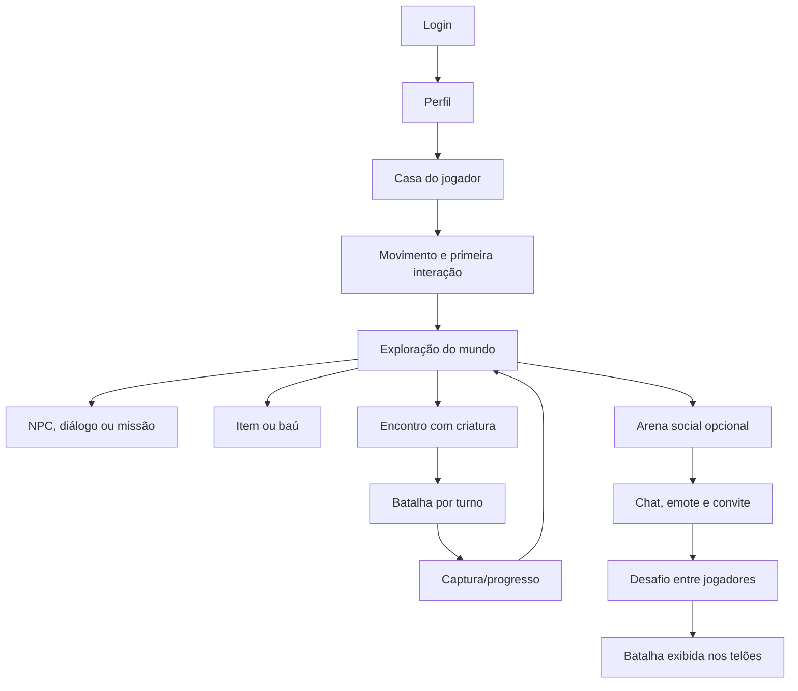
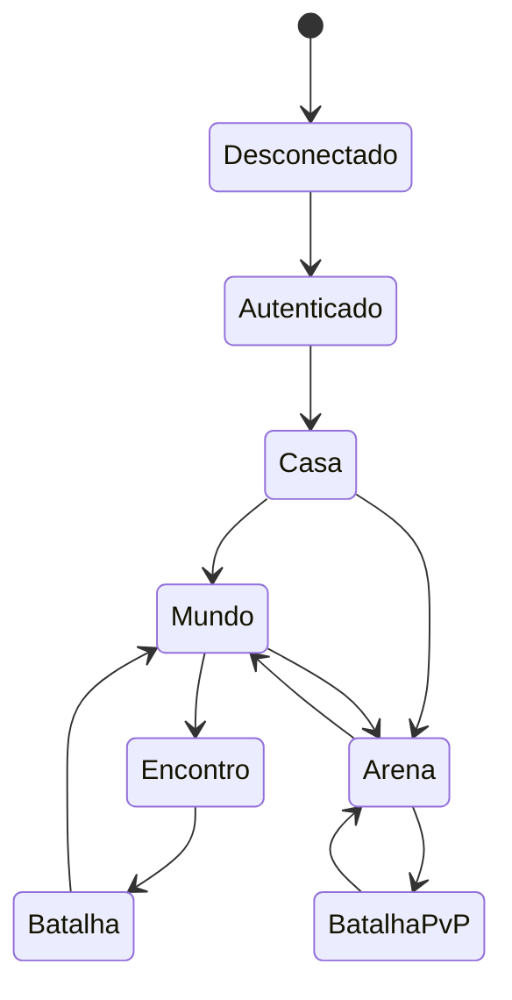

# Visão de game design

| Campo | Valor |
| --- | --- |
| Status | **Proposta funcional para revisão** |
| Atualizado em | 2026-07-23 |
| Implementação existente | Nenhuma |

## 1. Como interpretar este documento

- **[R] Requisito:** declarado pelo proprietário do projeto.
- **[P] Proposta:** hipótese de design que ainda precisa de aprovação.
- **[A] Aberto:** questão sem decisão suficiente.

Game design define experiência, regras e linguagem do produto. Ele não escolhe
infraestrutura. Limites técnicos ficam na baseline
[`../architecture.md`](../architecture.md) e na visão operacional
[`docs/architecture.md`](architecture.md).

## 2. Visão

- **[R]** RPG 2D online executado no navegador.
- **[R]** Experiência inspirada no gênero clássico de exploração e captura de
  criaturas.
- **[R]** Projeto privado, educacional e sem finalidade comercial.
- **[R]** Código e engine independentes de personagens, marcas e assets externos.
- **[R]** Progresso salvo por conta.
- **[R]** Suporte a desktop e dispositivos móveis.
- **[P]** A experiência prioriza descoberta, coleção, preparação e convivência social,
  sem monetização ou competição extrema.

## 3. Pilares

### 3.1 Exploração legível

O jogador deve entender onde pode andar, o que é interativo e qual foi o resultado de
uma ação. A primeira experiência começa na casa e ensina movimento antes de ampliar o
mundo.

### 3.2 Coleção com escolha

Captura, equipe, treinamento e itens devem criar decisões, não apenas acumulação.
Fórmulas e limites ainda precisam ser definidos.

### 3.3 Regras confiáveis

O cliente fornece feedback imediato, mas recompensas, captura, inventário, progresso e
resultado de batalha só se tornam definitivos após confirmação do servidor.

### 3.4 Social opcional e seguro

A arena acrescenta presença, conversa, desafios e espetáculo, sem impedir a progressão
individual de quem prefere explorar.

### 3.5 Conteúdo substituível

Criaturas, itens, mapas, NPCs, diálogos, emotes, arte e áudio são conteúdo. O catálogo
pode ser trocado sem reconstruir a engine.

### 3.6 Paridade desktop/mobile

Nenhuma ação essencial depende exclusivamente de hover, teclado ou clique preciso.
Controles, legibilidade e feedback devem funcionar por toque.

## 4. Jornada inicial

Requisitos da jornada:

1. **[R]** autenticar por e-mail e senha;
2. **[R]** entrar na casa do jogador;
3. **[P]** receber orientação curta de movimento e interação;
4. **[R]** sair para explorar;
5. **[R]** encontrar NPCs, itens e baús;
6. **[R]** encontrar, capturar e treinar criaturas;
7. **[R]** avançar por missões e progressão;
8. **[R]** entrar opcionalmente na arena;
9. **[R]** conversar, usar emotes, convidar e desafiar;
10. **[R]** assistir a batalhas nos telões.

## 5. Loops

### 5.1 Momento a momento

Mover → observar → interagir → receber feedback → decidir a próxima ação.

### 5.2 Sessão curta

Sair da casa/checkpoint → explorar uma zona → obter item, encontro ou progresso →
salvar checkpoint → retornar ou avançar.

### 5.3 Progressão

Completar missões → ampliar coleção/equipe → treinar/evoluir → acessar novas zonas e
desafios.

### 5.4 Social

Entrar na arena → encontrar jogadores → conversar/emotar → convidar → batalhar ou
assistir → retornar à arena.

## 6. Contextos do jogador

Somente um contexto controla comandos de gameplay por vez. UI/overlay pode permanecer
visível, mas não assume ownership das regras.

## 7. Exploração

### 7.1 Casa

- **[R]** Ponto inicial do jogo.
- **[P]** Funciona como spawn e checkpoint seguro.
- **[P]** Ensina movimento e uma interação simples.
- **[A]** Definir quais objetos e NPCs existem na primeira versão.

### 7.2 Mundo e mapas

- **[R]** Exploração em mapas 2D.
- **[P]** Mapas são divididos em zonas para carregamento e isolamento.
- **[P]** Portais, portas ou bordas explícitas realizam transições.
- **[P]** Objetos interativos usam IDs e capacidades declaradas.
- **[A]** Escolher formato e ferramenta de autoria de mapas.

### 7.3 NPCs e diálogos

NPCs podem oferecer uma ou mais capacidades:

- diálogo;
- missão;
- informação/tutorial;
- batalha;
- serviço ou troca, quando esse sistema for aprovado.

Diálogo é conteúdo declarativo. Regras não ficam embutidas no texto.

### 7.4 Itens e baús

- Itens possuem ID, categoria, stack, uso e efeitos definidos por dados.
- Baús possuem identidade e política explícita: único, recorrente ou compartilhado.
- Recompensa só aparece como definitiva após confirmação.
- **[A]** Definir capacidade de inventário, descarte, moeda e lojas.

## 8. Criaturas

### 8.1 Definição e instância

- **Definição:** espécie/conteúdo versionado, atributos base, habilidades e referências
  de assets.
- **Instância:** criatura pertencente a uma conta, com progresso e estado próprio.

O domínio usa IDs neutros. Nenhum nome ou sprite específico é requisito da engine.

### 8.2 Encontro e captura

- **[R]** Criaturas podem ser encontradas e capturadas.
- **[P]** Encontro nasce de uma regra da zona e de conteúdo validado.
- **[P]** Tentativa de captura é resolvida pelo servidor.
- **[P]** Item consumido e criatura criada pertencem à mesma operação atômica.
- **[A]** Fórmula, condições e recursos consumidos na captura.

Baseline aprovada para a Fase 9:

- captura exige vitória na batalha vinculada ao encontro;
- cada tentativa consome um `item:capture-orb`;
- chance base de 35%, acrescida de até 50 pontos percentuais conforme o alvo é
  enfraquecido, limitada a 85%;
- a seed do encontro decide a tentativa no servidor;
- item, resultado e eventual criatura são persistidos na mesma transação;
- falha, timeout, abandono ou desconexão encerram o encontro com retorno seguro.

### 8.3 Treinamento, progressão e evolução

- **[R]** Criaturas podem ser treinadas e evoluir.
- **[P]** Progressão usa eventos confirmados de batalha/missão.
- **[P]** Evolução é uma transição declarada pelo conteúdo.
- **[A]** Níveis, atributos, tamanho da equipe e condições de evolução.

## 9. Missões e progressão

- **[R]** O jogador progride e salva o avanço.
- **[R]** Missões reagem somente a eventos públicos confirmados do gameplay.
- **[R]** Eventos e recompensas são idempotentes por conta.
- **[R]** Conteúdo de missão tem versão e migração explícita; drift implícito é
  rejeitado.
- **[R]** A primeira expedição exige visitar a campina, conversar com a cuidadora,
  vencer uma batalha e capturar uma criatura.
- **[R]** A recompensa inicial é três Tônicos de Campo, respeitando os limites do
  inventário.
- **[P]** Missões futuras podem ser repetíveis quando o reset e a chave idempotente
  fizerem parte da definição.
- **[A]** Estrutura narrativa e desbloqueios posteriores.

Progressão global não deve exigir participação na arena, salvo decisão futura
explícita.

## 10. Batalha

### 10.1 Direção

- **[R]** Batalhas são separadas do modo de exploração.
- **[R]** Há batalhas contra NPCs e entre jogadores.
- **[R]** Batalhas são por turno.
- **[R]** O vencedor de uma batalha exibida deve ser anunciado.
- **[A]** Duração, fases e política de inatividade de cada turno.

### 10.2 Fluxo conceitual

Preparar participantes → iniciar instância → escolher ação → validar → resolver turno
→ verificar condição de fim → persistir resultado → retornar ao contexto de origem.

### 10.3 Regras obrigatórias de integridade

- servidor decide ordem, validade, RNG e resultado;
- comandos são sequenciados e não podem ser aplicados duas vezes;
- escolha privada não é enviada ao oponente/espectador antes da hora;
- timeout, abandono, empate e reconexão precisam de políticas explícitas;
- recompensa e progresso são confirmados uma única vez.

### 10.4 Questões abertas

- **[A]** Tamanho da equipe e quantidade de criaturas ativas.
- **[A]** Atributos, tipos, habilidades, efeitos e prioridades.
- **[A]** Condições de vitória/empate.
- **[A]** Duração de turno e política de inatividade.
- **[A]** Recuperação após derrota.
- **[A]** Balanceamento separado ou comum para NPC/PvP.

### 10.5 Baseline aprovada para batalha contra NPC

- **[P]** Uma criatura ativa por lado nesta primeira implementação.
- **[P]** Ações mínimas: atacar e defender.
- **[P]** O turno expira em 30 segundos; timeout, abandono ou desconexão resultam em
  derrota explícita.
- **[P]** A batalha termina por vida zerada ou em empate após 100 turnos.
- **[P]** RNG usa seed persistida e toda entrada é sequenciada para permitir replay.
- **[P]** O resultado registra recompensa de 100 pontos de experiência apenas em
  vitória e é persistido uma única vez; sua aplicação à criatura integra a progressão
  em uma etapa posterior.

Esta baseline serve à Fase 8 e não antecipa tipos, habilidades, efeitos ou regras de
PvP.

## 11. Arena social

### 11.1 Requisitos

- **[R]** Separada do modo de exploração.
- **[R]** Até 20 usuários simultâneos inicialmente por arena.
- **[R]** Avatares controláveis e presença online.
- **[R]** Chat exibido sobre personagens.
- **[R]** Emotes e reações.
- **[R]** Convites/desafios entre jogadores.
- **[R]** Telões mostrando batalhas em tempo real.

### 11.2 Propostas

- **[P]** Arena não é obrigatória para concluir a progressão principal.
- **[P]** Chat também aparece em um painel acessível, não só no canvas.
- **[P]** Chat é efêmero até existir política aprovada de retenção.
- **[P]** Emotes são IDs de um catálogo moderado.
- **[P]** Convites expiram e são de uso único.
- **[P]** Capacidade é validada novamente ao aceitar o convite.

### 11.3 Questões abertas

- **[A]** Jogadores assistindo contam no limite de 20?
- **[A]** Quantidade máxima de espectadores por batalha/telão.
- **[A]** Persistência, denúncia, mute e moderação do chat.
- **[A]** PvP afeta progressão/inventário ou é apenas competitivo/social?

## 12. Telões e espectadores

O telão exibe uma projeção pública, nunca o estado interno completo.

Informações previstas:

- **[R]** identificação pública dos competidores;
- **[P]** criaturas/avatares permitidos pela regra de visibilidade;
- **[P]** turno ou fase atual;
- **[P]** efeitos já revelados;
- **[R]** encerramento e anúncio do vencedor.

Informações proibidas:

- escolhas ainda secretas;
- tokens, IDs internos ou dados de conta;
- comandos;
- inventário privado;
- qualquer dado não incluído na allowlist pública.

O espectador é somente leitura. **[A]** Avaliar atraso configurável para evitar
espionagem em PvP.

## 13. Conta e salvamento

Estado durável pretendido:

- conta e sessão;
- perfil;
- checkpoint seguro;
- inventário;
- criaturas/equipe;
- progresso de missões;
- resultados necessários à progressão.

Presença, emote e convite expirado são efêmeros. Histórico de chat e replay completo
permanecem **[A]** até existir política de privacidade/retenção.

Após falha, o jogador retorna ao último estado seguro sem duplicar item, captura ou
recompensa.

## 14. UX, mobile e acessibilidade

- controles essenciais por teclado e toque;
- alvos de toque adequados;
- UI HTML/CSS para formulários e conteúdo textual;
- indicação de conectando, sincronizando, reconectando e desconectado;
- feedback pendente distinto de recompensa confirmada;
- chat disponível fora do texto flutuante;
- redução de efeitos e controles de áudio quando implementados;
- nenhuma informação essencial apenas por cor.

**[A]** Definir navegadores, resolução e dispositivo mobile de referência.

## 15. Conteúdo e propriedade intelectual

- conteúdo usa IDs genéricos e packs versionados;
- assets não são importados diretamente pela engine;
- pack placeholder deve ser original, CC0 ou comprovadamente licenciado;
- origem, autor e licença serão registrados;
- não distribuir sprites, sons, nomes, mapas ou dados extraídos de franquias;
- o caráter privado/educacional não substitui permissão.

## 16. Fora do escopo inicial

- monetização;
- marketplace ou troca entre jogadores;
- escala de MMO;
- mundo totalmente contínuo;
- cliente offline;
- aplicativo nativo;
- editor público de conteúdo;
- conteúdo sem licença comprovada;
- competição ranqueada complexa antes do núcleo jogável.

## 17. Decisões de design pendentes

Antes das fases que dependem delas, decidir:

1. formato/pipeline de mapas;
2. capacidade e regras do inventário;
3. atributos, equipe, treinamento e evolução;
4. fórmula e recursos de captura;
5. regras completas de batalha;
6. derrota, recuperação e penalidades;
7. estrutura e repetibilidade de missões;
8. economia, moeda e lojas;
9. regras e impacto do PvP;
10. espectadores, telões e atraso;
11. chat, moderação, denúncia e retenção;
12. acessibilidade, idiomas e dispositivos-alvo.

Uma questão aberta não deve ser resolvida por implementação implícita.
